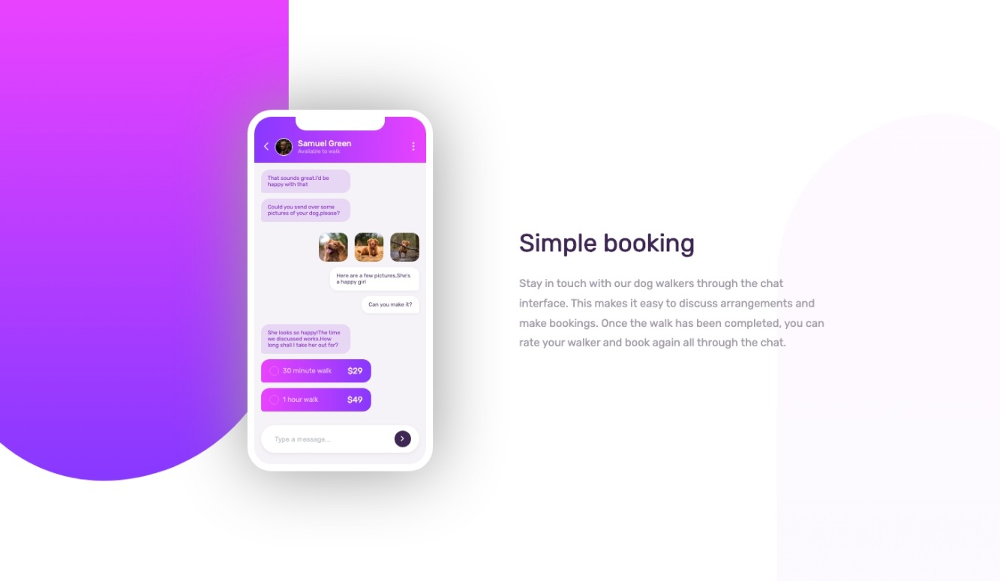

# Chat App Illustration Page

A responsive front-end project simulating a modern chat app's promotional landing page. Built with HTML and CSS.

## 🌐 Live Demo  
[👉 View Online](https://vanta-zjm.github.io/chat-app-illustration/index.html)

## 📸 Preview  

## 🛠️ Built With
- HTML5
- CSS3 (Flexbox)
- Google Fonts (Poppins)
- Responsive design techniques

## ✨ Key Features
- ✅ Section-based modular layout
- ✅ Responsive design for different screen sizes
- ✅ Clean typography and color balance
- ✅ Precise visual spacing and layout control

## 💡 What I Learned
- Structuring multi-section landing pages
- Using Flexbox for layout precision
- Applying typography hierarchy and design replication
- Strengthening mobile-first development habits

## 📄 License
MIT
